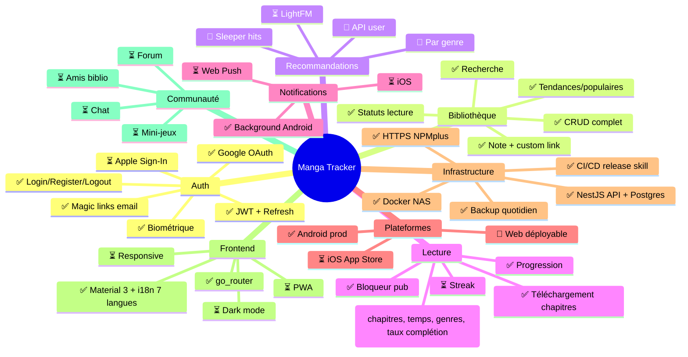

# Roadmap Manga Tracker

> **Source initiale** : carte mentale exportée le 04/05/2026 puis convertie en markdown versionnable.
> Ce fichier remplace le format `.mind` (binaire, non-diff-able). Il est édité au fil de l'eau.
>
> **Convention** : à la fin de chaque feature livrée, mettre à jour le marqueur correspondant
> (`⏳` → `🔵` quand le back est OK, puis `🔵` → `✅` quand le front consomme + tests OK).

## Légende

| Marqueur | Signification |
|---|---|
| ✅ | Feature **prête front + back** (livrée et testée) |
| 🔵 | Feature **prête côté back** (API OK, front à faire) |
| ❌ | Feature **abandonnée** (volontairement écartée) |
| ⏳ | Feature **à faire** (pas commencée ou en cours) |

---

## Gestion utilisateur

### ✅ Connexion à son compte utilisateur
### ✅ Déconnexion du compte utilisateur
### ✅ Création de compte utilisateur
### ✅ Suppression de compte utilisateur
### ✅ Changement de mot de passe du compte utilisateur
### ✅ Récupération du nom d'utilisateur
### 🔵 Photo de profil *(URL externe OK ; upload multipart à câbler Phase 3.1)*
### 🔵 Onboarding pour collecter des stats utilisateur *(champs profil étendus prêts ; modal d'onboarding à câbler)*

- 🔵 Tranche d'âge *(dateOfBirth en base + UI)*
- ⏳ Pays / Langue
- ⏳ Genre (sélection 3 genres environ)
- 🔵 Sexe *(champ gender en base + UI ChoiceChips)*

### ✅ Profil étendu (Phase 3) — displayName, bio, avatarUrl, isProfilePublic

---

## Authentification

### Interne

- ✅ Rester connecté après login (refresh token)
- ✅ Confirmation par mail (verify-email)
- ✅ Protection des endpoints (JWT guard)
- ✅ API Authentification
- ✅ Authentification biométrique
- ✅ Reset password via mail (magic link)

### Externe

- ✅ Authentification Google (mobile via `idToken` + web via OAuth WebView)
- ⏳ Authentification Apple (App Store requirement)

---

## Gestion de bibliothèque utilisateur

### Service bibliothèque

- ✅ Ajout
- ✅ Suppression
- ✅ Consultation
- ✅ Gestion de l'état de lecture
- ✅ Note personnelle (rating 0-10)
- ✅ Lien personnalisé (custom link)

### ✅ Recherche sur tous les noms des mangas
### ✅ Récupération d'un manga spécifique

- ✅ Traduire les champs (description)

### ✅ Affichage des tendances/nouveautés/populaires
### ✅ Filtrer les contenus mature
### ❌ Favoris *(remplacé par les statuts de lecture)*

- ❌ Voir tous les mangas favoris
- ❌ Ajout
- ❌ Suppression

### ✅ Historique de recherche

---

## Système de notation et avis

### ✅ Collecte des avis (commentaires utilisateurs) *(Phase 7 + 7.1 — livré : threading, soft delete, rating optionnel, pagination)*
### Affichage des notes

- ✅ Affichage des notes MangaUpdates
- 🔵 Affichage des notes MangaTracker (agrégées) *(API prête, front à câbler)*

### ⏳ Interface de notation avancée

---

## Suivi de lecture

### ✅ Mise à jour instantanée de l'état (reading/completed/caughtUp/readLater)
### ⏳ Filtres avancés de notifications

### Lecture

- ✅ Enregistrement de la progression
  - ⏳ Regrouper les chapitres par tome ou arc
- ✅ Téléchargement de chapitre (Android/iOS uniquement)
- ✅ Bloqueur de pub dans le webview

### Statistiques

- ✅ Nombre total de chapitres lus *(Phase 2)*
- ✅ Estimation du temps de lecture (chapitres × durée moyenne) *(Phase 2)*
- ✅ Top genres les plus consultés *(Phase 2)*
- ✅ Taux de complétion + dernière lecture + ancienneté du compte *(Phase 2)*
- ⏳ Streak de lecture
- ⏳ Progression vers un objectif personnel

### ✅ Status de lectures (reading / readLater / completed / caughtUp / dropped)

---

## Recommandations personnalisées

### 🔵 Suggestions basées sur l'historique de lecture *(API + tests prêts)*
### 🔵 Recommandations par genre (`/recommendations/by-genre`)
### 🔵 Sleeper hits (pépites cachées) — `/recommendations/sleepers`
### ⏳ Modèle hybride LightFM (interactions explicites + features)

- ⏳ Ignorer un manga des recommandations (déjà en cours / déjà lu)

---

## Espace communautaire

### ✅ Système d'amis *(Phase 6 + 6.1 — backend + UI livrés)*

- ✅ Demande / accept / refuser / bloquer / supprimer
- ✅ Recherche d'utilisateurs (autocomplete)
- ✅ Page Amis (onglets + recherche + cache 24h)
- ⏳ Badge BottomNavBar (compteur global polling)

### ⏳ Forum et discussions
### ⏳ Partage de théories
### ⏳ Mini-jeux communautaires
### ⏳ Chat en temps réel
### ⏳ Voir la bibliothèque de ses amis
### ✅ Partage de manga entre amis *(Phase 8 + 8.1 — modal partage + inbox + badge nouveau)*

---

## Redirection vers plateformes

### ✅ Liens directs vers des sites légaux de lecture
### ✅ Lien personnalisé de l'utilisateur

- ✅ Affichage de la page avec WebView (mobile)
- ✅ Ouverture dans un nouvel onglet (web — `url_launcher`)

### ✅ Mise à jour automatique des liens

---

## Alertes de nouvelles sorties

### ⏳ Notification des nouveaux chapitres/volumes
### ⏳ Mise à jour automatique des alertes (liens, filtres)
### ✅ Vérification background des nouveaux chapitres (workmanager Android)
### ⏳ Background fetch iOS (BGTaskScheduler)
### ⏳ Service worker Web pour notifications push

---

## Sécurité et Conformité

### ✅ Conformité RGPD (article 15 / 17 / 20 / 7)

- ✅ Endpoints `/user/gdpr/summary`, `/export`, `/consent`, `/consent-status`
- ✅ Page « Mes données » dans le profil
- ✅ Cascade DELETE sur user (user_manga + user_session)
- ✅ Consentement obligatoire à l'inscription (CGU + Privacy)
- ✅ Re-consentement après mise à jour des versions
- ⏳ Audit complet vis-à-vis des recommandations CNIL

### ✅ Endpoint transparent renvoyant les images de MangaUpdates *(Phase 4 — proxy + auto-refresh)*

---

## Optimisation et Performances

### Cache

- ✅ Cache local SharedPreferences (24h sur library/manga/homepage/search, 7j sur user)
- ✅ Cache mémoire LRU dans BLoCs
- ⏳ Pré-calcul + mise en cache périodique des scores de recommandation (Redis)
- ⏳ Génération nocturne des recommandations pour tous les utilisateurs

### Base de données

- ⏳ Indexer la colonne `mu_id` pour optimiser les requêtes de lecture
- ✅ Utiliser les données en base si dernière actualisation < 6h
  - ⏳ Pour les manga non updaté depuis 24h, actualiser 1 fois

### Backups

- ✅ Backup PostgreSQL prod quotidien (3h UTC) via SSH NAS + rotation 30 jours

---

## Fonctionnalités complémentaires

### ⏳ Ajouter les noms des mangas dans les différentes langues
### ⏳ Trier la liste des mangas (date modification, alphabétique)
### ⏳ Ajouter l'autocomplétion lors de la recherche
### ⏳ Ajouter traduction anglais/français (faisabilité à étudier)
### ❌ Lire un manga directement dans l'application *(scraping = zone grise légale)*

---

## CI/CD et Qualité du code

### ✅ Formateur + linter dans le pipeline CI/CD pour les PR
### ✅ Automatisation linter + formatter
### ✅ Déploiement de l'image d'intégration (Docker Hub + TrueNAS)
### ✅ Skill `/release` (workflow_dispatch + bump version + changelog automatique)
### ✅ Trigger pipeline release sur `main` (au lieu de `dev`)
### ⏳ Automatisation training → test → publication du modèle LightFM

---

## Infrastructure et Environnement

### ✅ Mise en place de Swagger pour documenter les endpoints de l'API
### ✅ Création du repository de l'API
### ✅ Connexion à la base de données de prod (TrueNAS PostgreSQL)
### ✅ Déploiement de l'image d'intégration
### ✅ Construction de l'image `latest` à partir de `master`
### ✅ Reverse proxy NPMplus + HTTPS Let's Encrypt
### ⏳ Endpoint pour récupérer l'image de couverture d'un manga (proxy CORS)
### ⏳ Mention « données provenant de l'API MangaUpdates »

### Environnement ML dédié

- ⏳ Serveur ou container Docker pour entraînement LightFM (GPU/CPU)
- ⏳ Stockage et versioning des modèles (MLflow ou DVC)

---

## Frontend et Expérience utilisateur

### ✅ Page de connexion
### ✅ Maquette tendances/nouveautés/populaires
### ✅ Bottom navbar (4 tabs : Home / Library / Search / Profile)
### ✅ Page gestion de compte
### ⏳ Thème sombre *(en cours sur la branche `feature/dark-mode`)*
### ⏳ Calendrier mensuel/semaine des dates de parution pour les séries suivies
### ⏳ Score de compatibilité LightFM (affichage)
### ✅ Page Detail Manga
### ✅ Recherche manga

- ⏳ Améliorer la pertinence des résultats

### ✅ i18n complète 7 langues (fr, en, de, ja, ko, pt, es)

---

## Web (PWA)

### ✅ Build Flutter Web fonctionnel (auth + biblio + recherche + détails + recommendations)
### ✅ Migration `MaterialPageRoute` → `go_router` (deep-linking)
### ✅ Stubs propres pour features web-incompatibles (download, offline reader, workmanager)
### ✅ Pipeline CI/CD web → Nginx Docker → NAS via NPMplus
### 🔵 Domaine `app.bladeburu.com` *(infra prête, attente lancement 1er deploy)*
### ⏳ Layouts responsive (LayoutBuilder mobile/tablette/desktop)
### ⏳ PWA installable (manifest + service worker activés)
### ⏳ Adaptation des largeurs hardcodées au format desktop

---

## iOS (App Store) — non démarré

### ⏳ Configuration `Info.plist` (NSCameraUsage, NSPhotoLibraryUsage, NSFaceIDUsage)
### ⏳ Bundle Identifier + Team ID + Provisioning Profile
### ⏳ Cupertino fallbacks pour widgets purement Material
### ⏳ Notifications via `DarwinInitializationSettings`
### ⏳ Background fetch iOS (BGTaskScheduler) au lieu de workmanager
### ⏳ Build `.ipa` signé via Fastlane

---

## Visualisation Mermaid

---

## Avancement global *(à régénérer après chaque release)*

| État | Compte | Description |
|---|---:|---|
| ✅ Prêt (front + back) | ~55 | Livré et testé |
| 🔵 Prêt (back uniquement) | ~5 | API OK, attente front |
| ⏳ À faire | ~70 | Backlog |
| ❌ Abandonné | 3 | Volontairement écartés |

---

## Comment maintenir ce fichier

1. Quand une feature passe en prod (front + back validés) → changer `⏳` ou `🔵` en `✅`
2. Quand le back est OK mais que le front est encore à faire → mettre `🔵`
3. Quand on décide d'abandonner une feature → mettre `❌` avec une justification entre `*( )*`
4. Pour ajouter une nouvelle catégorie → respecter le pattern `## Catégorie` puis `### feature` puis `- sous-feature`
5. Mettre à jour le bloc Mermaid à la fin pour qu'il reste représentatif (vue d'ensemble)
6. Mettre à jour le tableau d'avancement global après chaque release
